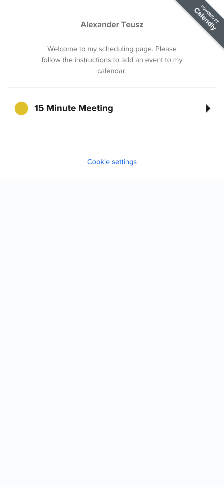
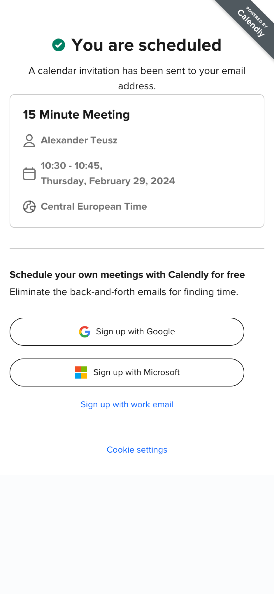

# Calendly

This xApp lets the user schedule a meeting via Calendly. Therefore, an official Calendly account is required.

**Requirements:**

Please follow this documentation in order to copy the required script that must be added to the [xapp.html](./xapp.html) file: https://help.calendly.com/hc/en-us/articles/4409838727703-Embedding-Calendly-on-your-site

Please replace the entire HTML in between the Calendly inline widget comments or just the `YOUR_ACCOUNT` name displayed in the `data_url` property: 
```html
      <!-- Calendly inline widget begin -->
        <div
          class="w-full h-full calendly-inline-widget"
          data-url="https://calendly.com/YOUR_ACCOUNT?hide_gdpr_banner=1"
        ></div>
        <script
          type="text/javascript"
          src="https://assets.calendly.com/assets/external/widget.js"
          async
        ></script>
        <!-- Calendly inline widget end -->
```

**Example:**




As this xApp embeds the Calendly component wihout listening to further events, there is nothing sent to the Cognigy.AI Flow. Hence, the virtual agent can continue directly.
