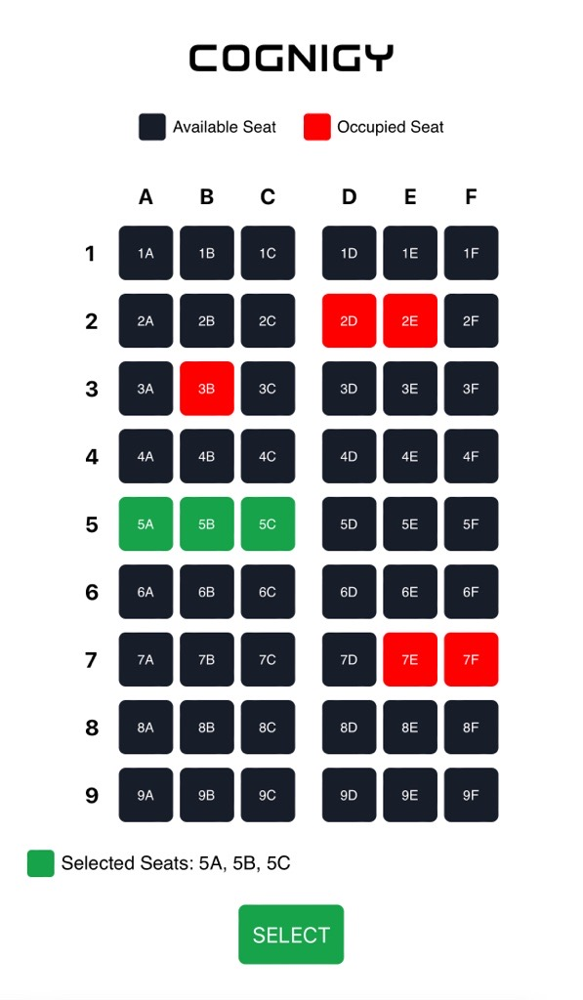

# Flight Seat Picker

This xApp displays an example seat map of an airplane:



The user can select one or multiple seats that are sent to Cognigy.AI by clicking the "Select" button. In this case, the following data is sent to the `{{input.data}}` object:

```json
{
  "data": {
    "_cognigy": {
      "_app": {
        "type": "submit",
        "payload": {
          "seats": ["5A", "5B","5C"]
        }
      }
    }
  }
}
```
