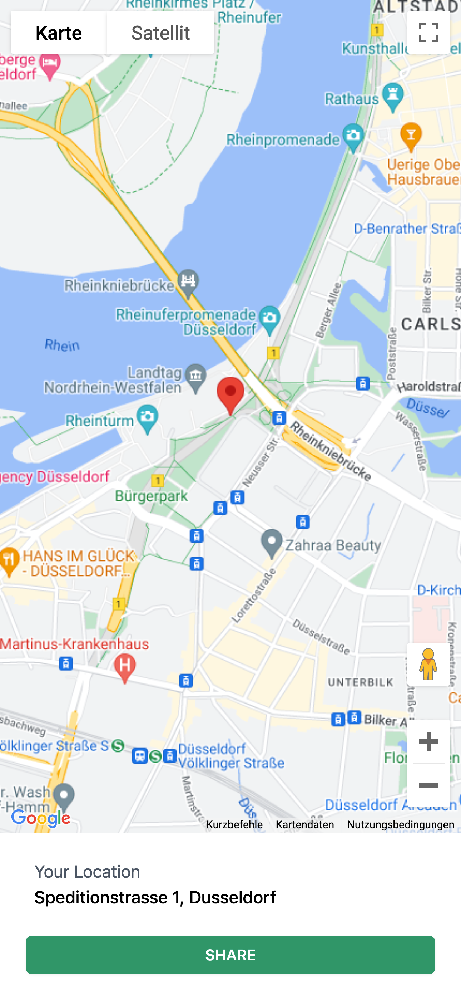

# Google Maps Location

This xApp displays a Google Map with the current user location based on their browser. Furthermore, it displays the actual place/geolocation.

**Required API Keys:**
- [Google Geolocation API](https://developers.google.com/maps/documentation/geolocation/overview?hl=en)
- [Google Maps JavaScript API](https://developers.google.com/maps/documentation/javascript/overview?hl=en)

**Example:**



The user can see their current location and click a "SHARE" button in order to continue with the conversation by sending the info to the virtual agent:

```json
{
  "data": {
    "_cognigy": {
      "_app": {
        "type": "submit",
        "payload": {
          "position": {
            "lat": 51.2141616,
            "lng": 6.749175
          },
          "location": "Speditionstraße 1, 40221 Düsseldorf, Deutschland"
        }
      }
    }
  }
}
```
