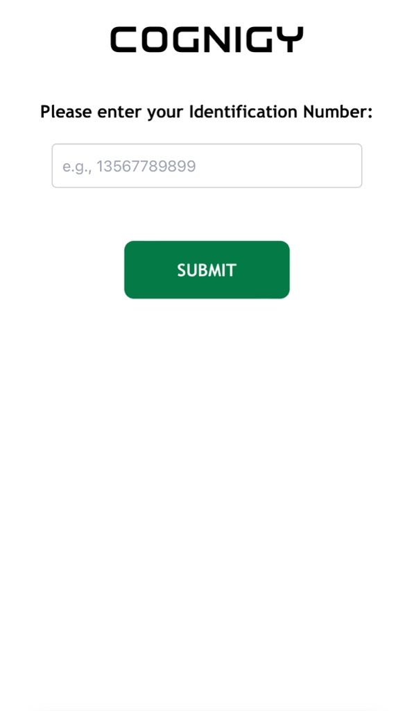
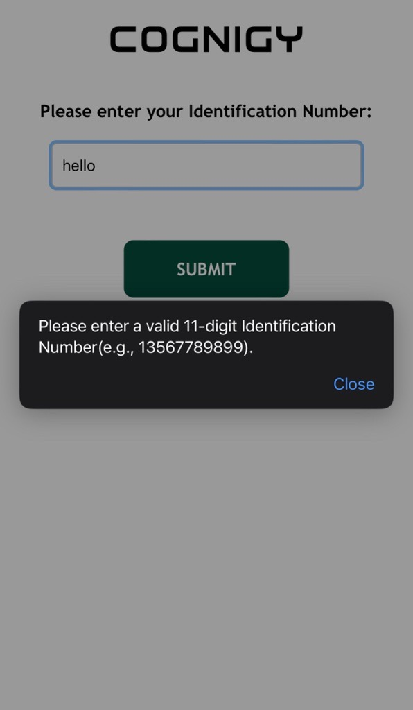

# Identification

This xApp is used to identifiy the user:





The user provides a identification code on their device, such as a smartphone, and submit it to be sent to Cognigy.AI, the following data is sent to the `{{input.data}}` object:

```json
{
 "data": {
    "_cognigy": {
      "_app": {
        "type": "submit",
        "payload": {
          "id": "12345678912"
        }
      }
    }
 }
}
```

The format of the identification code is defined using a regular expression(regex) in the xApp.