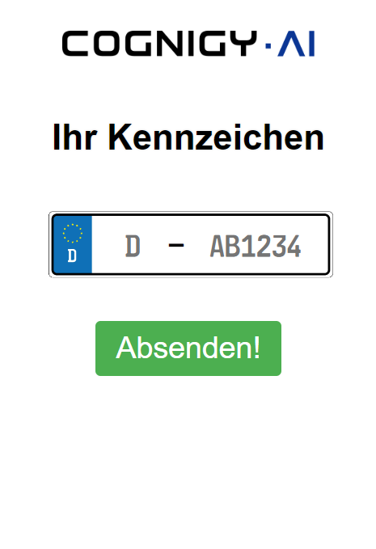

# German License Plate Form

This xApp displays an example form for German license Plates with a filtered dropdown for cities/municipalities and a regex check before:



The user can enter their license plate number into the form and the following data will then be in the `{{input.data}}` object:

```json
{
  "data": {
    "_cognigy": {
      "_app": {
        "type": "submit",
        "payload": {
          "license-plate-locale": "AB",
          "license-plate-number": "CD1234"
        }
      }
    }
  }
}
```
