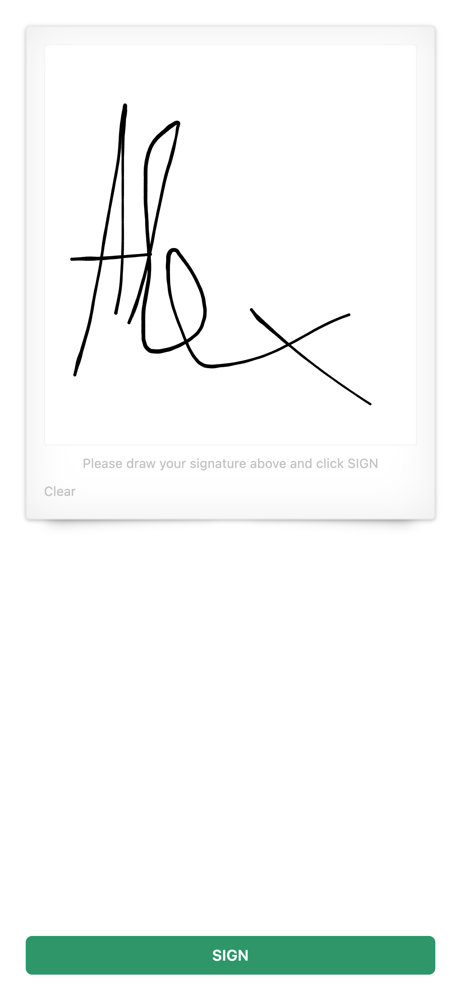

# Signature

This xApp lets the user sign something:



The user can provide a signature on their device, such as a smartphone, and submit it to be sent to Cognigy.AI. In this case, the following data is sent to the `{{input.data}}` object:

```json
{
  "data": {
    "_cognigy": {
      "_app": {
        "type": "submit",
        "payload": {
          "signaturePng": "data:image/png;base64,iVBO..."
        }
      }
    }
  }
}
```

The signature, which is sent as base64 image to `{{input.data._cognigy._app.payload.signaturePng}}` can be displayed with a Say Node or stored in antoher system -- for example.