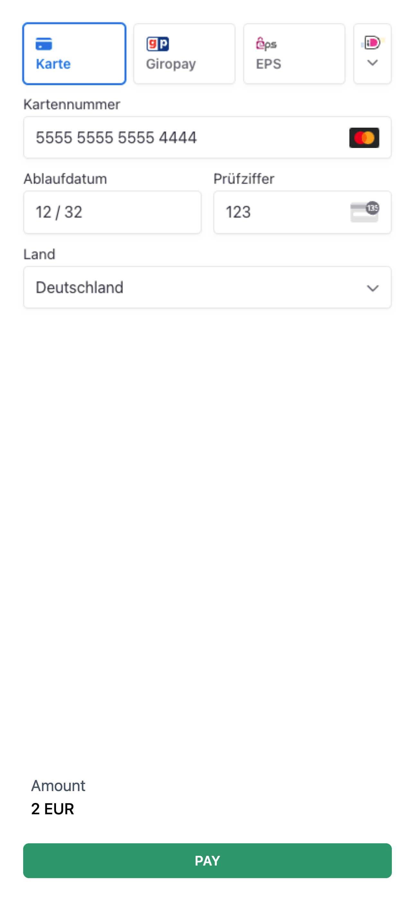
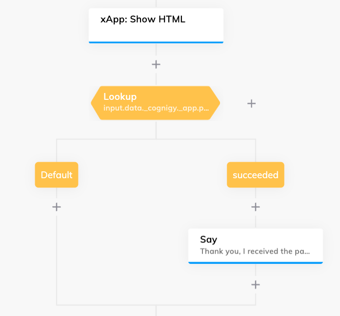

# Stripe Payment

This xApp displays a Stripe Payment component that processes a valid payment behind the scenes without sharing sensitive information with Cognigy.AI. As soon as the payment was successfull, Cognigy.AI receives the 

**Requirements:**

One must have a Stripe account with a valid `published_secret_key`. More information about this can be found here:
- [Stripe API Authentication](https://docs.stripe.com/api/authentication)

Moreover, the [Stripe Extension](https://www.cognigy.com/platform/cognigy-marketplace#/extension/stripe) must be installed in order to create a Payment Intent that is used within the xApp. Hence, the xApp uses the `amount`, `currency` and `client_secret` of the current user's payment intent in order to provide available payment options.

**Example:**




The user can see the currently available payment options based on their payment intent. Every payment field, such as the credit card details, are populated by Stripe automatically and independent from Cognigy.AI. By clicking on the "PAY" button, the Stripe API is used to fulfill the payment:

```json
{
 "data": {
    "_cognigy": {
      "_app": {
        "type": "submit",
        "payload": {
          "paymentIntent": {
            "id": "...",
            "object": "payment_intent",
            "amount": 200,
            "amount_details": {
              "tip": {}
            },
            "automatic_payment_methods": {
              "allow_redirects": "always",
              "enabled": true
            },
            "canceled_at": null,
            "cancellation_reason": null,
            "capture_method": "automatic",
            "client_secret": "...",
            "confirmation_method": "automatic",
            "created": 123,
            "currency": "eur",
            "description": null,
            "last_payment_error": null,
            "livemode": false,
            "next_action": null,
            "payment_method": "...",
            "payment_method_configuration_details": {
              "id": "...",
              "parent": null
            },
            "payment_method_types": [
              "card",
              "bancontact",
              "eps",
              "giropay",
              "ideal",
              "link"
            ],
            "processing": null,
            "receipt_email": null,
            "setup_future_usage": null,
            "shipping": null,
            "source": null,
            "status": "succeeded"
          }
        }
      }
    }
}
```

The `status` can be used right after waiting for the xApp in order to let the user know about the results. Hence, one can use a [Lookup](https://docs.cognigy.com/ai/flow-nodes/logic/lookup/) Flow Node and check for `input.data._cognigy._app.payload.paymentIntent.status`:



For testing, one can use the official testing cards from Stripe: https://docs.stripe.com/testing 
